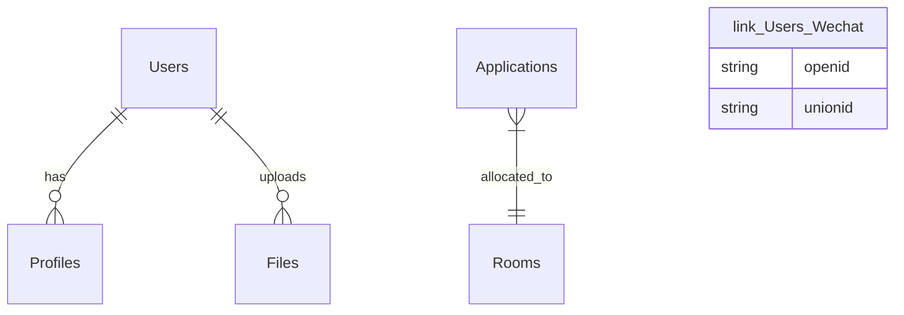

# 系统架构设计文档 - 同心源 2026

**严重架构变更 (2026-01-28)**:
*   **部署策略**: 迁移至 **外部构建策略** (本地交叉编译)，解决 ECS 内存/网络瓶颈。
*   **网络模式**: 采用 **Docker Host 模式** + `iptables` (80->8080) 解决 ECS 端口封禁与 Bridge 网络不通问题。
*   **路由架构**: 实施 **双模布局** (公众端/管理端物理隔离)。

## 1. 架构概览

本项目采用 **双后端微服务架构**，通过 **Docker Compose** 编排。
针对 **2核 2G 内存** 的 ECS 实例，我们将采用**资源紧凑型** 配置策略。

### 系统上下文图
```mermaid
graph TD
    User_Mobile[手机用户 (家庭/社工)] --微信小程序/H5--> Nginx
    User_PC[PC用户 (管理后台)] --Web Portal--> Nginx
    
    subgraph "阿里云 ECS (2vCPU / 2GB RAM)"
        Nginx[Nginx 网关]
        
        subgraph "应用服务层"
            NextApp[Next.js App\n(管理后台 + API)]
            PyAgent[Python API\n(AI 任务/爬虫)]
        end
        
        subgraph "数据存储层"
            PG[(PostgreSQL\n+ pgvector)]
            Redis[(Redis Cache)]
            LocalDisk[本地磁盘文件存储\n(Docker Volume)]
        end
        
        Nginx --> NextApp
        Nginx --> PyAgent
        NextApp --> PG
        NextApp --> Redis
        NextApp --> LocalDisk
        PyAgent --> PG
        PyAgent --> Redis
    end
    
    subgraph "客户端应用"
        TaroApp[Taro 小程序\n(Phase 2 预留)]
    end
    
    TaroApp -.-> Nginx
    PyAgent --API--> Aliyun[阿里云通义千问]
    PyAgent --Cron--> GovWeb[民政/医保官网]
```

---

## 2. 技术栈详细选型

### 2.1 客户端
*   **Web 端/后台**: **Next.js 14+ (App Router)**
    *   *理由*: MVP 核心。同时适配 Desktop 和 Mobile 浏览器 (响应式设计)。
*   **UI 框架**: **Shadcn/ui (Web)**
*   **[Phase 2] 微信小程序**: **Taro (React)**
    *   *理由*: 预留技术栈，二期开发。

### 2.2 服务端
*   **主应用**: **Next.js API Routes**
    *   处理用户认证、业务 CRUD。
*   **AI 增强**: **Python (FastAPI)**
    *   处理 LLM 交互、爬虫、数据清洗。
*   **数据库**: **PostgreSQL 16 (开源版)**
    *   *理由*: 免费，功能强大。开启 `pgvector` 插件支持 AI 向量检索。
*   **缓存**: **Redis** (轻量级配置)

### 2.3 基础设施
*   **服务器**: 阿里云 ECS (2核 2G 40G)
*   **容器化**: **Docker Compose**
*   **文件存储**: **ECS 本地磁盘 (Docker Volume)**
    *   *注意*: 40G 空间有限，需定期清理日志，非核心视频数据建议二期上 OSS。

---

## 3.  2G 内存环境优化策略 (关键)

**鉴于 ECS 只有 2GB 内存，必须进行严格的资源限制：**

1.  **构建策略**:
    *   🚫 **禁止在 ECS 上执行 `npm run build`**: 这会导致 OOM (内存溢出) 崩溃。
    *   ✅ **本地构建 / CI 构建**: 在本地电脑 Build 成 Docker 镜像，推送到阿里云容器镜像服务 (ACR 个人版免费)，ECS 只负责 `docker pull` 和 `run`。
2.  **Swap 交换分区**:
    *   ECS 初始化时配置 **4GB Swap**。当物理内存不足时，使用磁盘充当内存，防止进程被杀。
3.  **JVM/进程限制**:
    *   **PostgreSQL**: 调整 `shared_buffers` 为 256MB (默认通常较高)。
    *   **Next.js**: 启动时添加 `NODE_OPTIONS='--max-old-space-size=512'` 限制堆内存。
    *   **Python**: 使用轻量级 WSGI (Uvicorn)，Worker 数设为 1。

---

## 4. 数据库模型设计

### 4.1 核心 E-R 关系


### 4.2 关键表结构

**User (用户表 - 统一身份)**
*   `id`: UUID
*   `phone`: 手机号
*   `role`: ADMIN | VOLUNTEER | FAMILY
*   `wechat_openid`: 小程序 OpenID

**File_Storage (文件索引表)**
*   `id`: UUID
*   `file_path`: `/uploads/images/2026/01/xxx.jpg` (本地相对路径)
*   `file_type`: IMAGE | VIDEO | DOC
*   `size`: KB
*   `uploader_id`: FK(User)

**Point_Log (积分流水 - 激励体系)**
*   `id`: UUID
*   `user_id`: FK(User)
*   `action`: CHECK_IN | AI_GENERATE | SHARE
*   `points`: +10
*   `created_at`: Time

---

## 5. 部署架构

### 5.1 目录结构 (Monorepo)
```text
/tongxinyuan
  ├── docker-compose.yml      # 编排文件
  ├── /apps
  │    ├── /web               # Next.js 主应用 (Admin + Mobile H5)
  │    ├── /miniprogram       # [Reserve] Taro 小程序
  │    └── /ai-agent          # Python FastAPI
  ├── /packages               # 共享代码 (TS类型/工具函数)
  └── /data                   # 挂载的本地数据卷 (PGData, Uploads)
```

### 5.2 安全与备份
1.  **数据备份**: `pg_dump` 每日导出 SQL 文件，保留最近 7 天，压缩存储在本地 `/backup` 目录。
2.  **API 安全**:
    *   Next.js 与 Python 服务走 **内部 Docker 网络** 通信，不暴露 Python 端口到公网。
    *   Web 访问全部经过 Nginx (配置 SSL)。

---

## 6. 开发与上线流程
1.  **本地开发**: 启动 Docker Compose (Dev 模式，挂载代码目录)。
2.  **小程序调试**: 运行 `npm run dev:weapp`，使用微信开发者工具预览。
3.  **上线发布**:
    *   Web: 本地 build docker image -> push -> ECS pull & restart。
    *   小程序: 本地 build -> 微信开发者工具上传审核。
