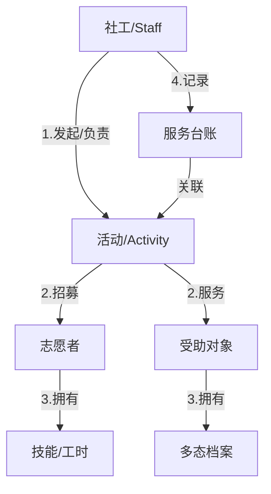

# 同心源社区支持中心 - 系统需求规格说明书 (V2.0)

**生效日期**: 2026-01-31
**状态**: 正式归档 (Approved)

本文档基于 V1.0 版网站及后续深度业务调研，对系统核心需求进行重构与升维。**本系统不再仅仅是一个信息门户，而是支撑机构核心业务运转的公益 ERP 系统。**

---

## 1. 业务愿景与核心实体

### 1.1 系统定位
从“以文章为主”转型为 **“以人+事为主”**。
*   **旧模式**: 发布新闻 -> 等待咨询 -> 线下处理。
*   **新模式**: 维护档案(人) -> 策划活动(事) -> 招募/匹配 -> 执行记录 -> 数据沉淀。

### 1.2 核心实体关系图 (ER Concept)

---

## 2. 详细需求：角色与权限 (RBAC)

系统将内部用户（Staff）与外部用户（User/Guest）严格切分。

### 2.1 内部角色 (Staff)
| 角色 | 职能定义 | 关键权限 | 禁止事项 |
| :--- | :--- | :--- | :--- |
| **机构管理者 (Manager)** | 决策监督 | 查看全盘数据/趋势/高敏隐私(性侵/司法)。 | 修改底层系统配置。 |
| **社工 (Social Worker)** | **项目经理** | **活动全生命周期管理** (发起/招募/实施/复盘)。 志愿者运营 (排班/评价)。 受助者建档。 | **删除账号**、重置他人密码。 |
| **网站管理员 (Admin)** | 运维支持 | 系统设置、CMS发布、账号安全管理。 | **查看受助者隐私档案**。 |

---

## 3. 详细需求：受助者档案系统 (Beneficiaries)

废除单一“家庭”概念，升级为**多态档案**。

### 3.1 档案类型
系统需支持以下类型的差异化字段记录：

*   **A. 大病患儿家庭** (核心流转对象)
    *   数据: 患儿姓名、诊断、医院、首诊时间、治疗方案。
    *   *业务*: 住宿申请、物资领取、共享厨房。
*   **B. 花季女童** (长期帮扶对象)
    *   数据: 学校、年级、家庭关系。
    *   **经济评估**: 纯文本记录 `economic_status_raw` (如：“田地3亩，年收入约5000元，离异”)，暂不自动计算分数。
*   **C. 受性侵儿童/司法援助** (高敏对象)
    *   数据: 案件进度、心理状态。
    *   **隐私控制**: **最高密级**。仅限 Manager 及专案组社工可见。无需物理分库，但需逻辑强隔离。
*   **D. 安宁疗护对象**
    *   数据: 疼痛评估、心愿单。
*   **E. 临时/大众对象**
    *   数据: 基础联系方式、来源渠道。

---

## 4. 详细需求：活动生命周期 (Activity Lifecycle)

系统需支持标准化的活动管理流。

### 4.1 阶段一：策划与招募
*   社工创建活动 (类型: 节日/家访/入校/培训)。
*   生成**报名链接/海报**。
*   **双向招募**:
    *   招募志愿者 (长期/临时)。
    *   邀请受助对象 (从档案库筛选或公开报名)。

### 4.2 阶段二：志愿者分级管理
*   **长期志愿者 (Registered)**:
    *   有独立账号，记录累计工时、技能标签。
    *   可接收定向推送。
*   **临时志愿者 (Guest)**:
    *   **无账号**，仅在单次活动中记录姓名/电话。
    *   数据存入“活动参与表”，不污染主用户库。

### 4.3 阶段三：实施与记录
*   **移动端现场工具**: 社工在活动现场通过手机进行：
    *   扫码签到 (志愿者/家庭)。
    *   拍照/上传文档 (关联到该活动)。

### 4.4 阶段四：复盘与归档
*   填写活动总结 (富文本)。
*   系统自动统计：参与人数、服务时长、物资消耗。
*   生成活动报告。

---

## 5. 开发路线图 (Roadmap)

1.  **Phase 6: 权限重构 (RBAC)**
    *   建立 `staff` 体系，区分社工/管理员/管理者。
2.  **Phase 7: 领域建模 (Schema V2)**
    *   实现 `beneficiaries` (多态) 和 `activities` (活动流) 数据库。
3.  **Phase 8: 业务功能实现**
    *   开发“社工工作台”与“活动管理”界面。
