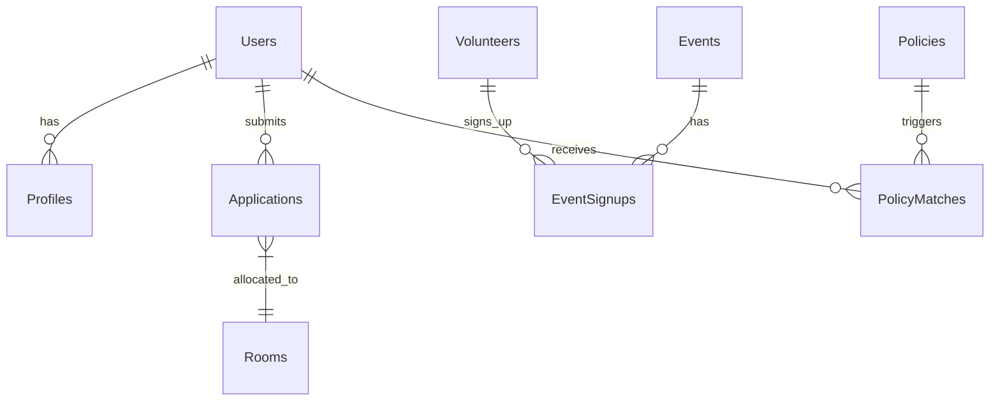

# 系统架构设计文档 (System Architecture) - Tongxinyuan 2026

## 1. 架构概览 (Architecture Overview)

本项目采用 **双后端微服务架构 (Dual-Backend Microservices)**，通过 **Docker Compose** 进行统一编排与部署。
利用 Next.js 处理高并发 Web 业务，Python (FastAPI) 处理 AI 智能任务，PostgreSQL 作为统一数据底座。

### 系统上下文图 (System Context)
```mermaid
graph TD
    User_Family[患儿家庭] --微信/H5--> Nginx
    User_Volunteer[志愿者] --微信/H5--> Nginx
    User_Admin[社工/管理] --Web Portal--> Nginx
    
    subgraph "阿里云 ECS (Docker Host)"
        Nginx[Nginx 网关]
        
        subgraph "应用服务层"
            NextApp[Next.js App\n(业务主系统)]
            PyAgent[Python AI Agent\n(智能副驾驶)]
        end
        
        subgraph "数据存储层"
            PG[(PostgreSQL\n+ pgvector)]
            Redis[(Redis Cache\n+ Queue)]
        end
        
        Nginx --> NextApp
        Nginx --> PyAgent
        NextApp --> PG
        NextApp --> Redis
        PyAgent --> PG
        PyAgent --> Redis
    end
    
    PyAgent --API--> Aliyun[阿里云通义千问]
    NextApp --Oss SDK--> OSS[阿里云 OSS 对象存储]
    PyAgent --Cron--> GovWeb[民政/医保官网]
```

---

## 2. 技术栈详细选型 (Tech Stack)

| 层级 | 技术选型 | 理由 (Rationale) |
| :--- | :--- | :--- |
| **前端/应用端** | **Next.js 14+ (App Router)** | React 生态标准，SEO 友好（对公益传播重要），全栈能力处理常规业务 API。 |
| **UI 框架** | **Tailwind CSS + Shadcn/ui** | 现代化、可定制性强，适合快速构建美观的“适老化”界面。 |
| **AI 后端** | **Python (FastAPI)** | Python 是 AI 的原生语言，方便处理爬虫 (Scrapy)、RAG (LangChain/LlamaIndex) 和数据清洗。 |
| **数据库** | **PostgreSQL 16** | 关系型数据的王者。插件 **pgvector** 可直接存储向量数据，避免引入额外的 Vector DB，降低运维复杂度。 |
| **缓存/队列** | **Redis** | 处理 Celery 任务队列（爬虫、AI 生成任务）和 Session 缓存。 |
| **部署** | **Docker Compose** | 单机编排神器，配置即文档，完美匹配 ECS 单节点部署，方便未来水平扩展。 |
| **反向代理** | **Nginx** | 处理 SSL 终结、静态资源缓存、负载均衡。 |

---

## 3. 核心功能模块设计 (Core Modules)

### 3.1 业务主系统 (Next.js)
1.  **用户中心 (Identity)**:
    *   基于 `NextAuth.js`。
    *   支持微信登录（OAuth）、手机验证码登录。
    *   **RBAC 模型**: Admin (社工), Volunteer (L1-L3), Family (Guest/Verified).
2.  **家庭服务 (Family Service)**:
    *   入住申请流（表单 -> 审批 -> 房号分配）。
    *   物资申领 / 共享厨房预约。
3.  **志愿者管理 (Volunteer Ops)**:
    *   活动发布 / 排班报名 / 扫码签到。

### 3.2 AI 智能体系统 (Python FastAPI)
1.  **政策哨兵 (Policy Watchdog)**:
    *   `Worker 1`: 每周爬取指定政府网站 -> 清洗 -> 存入 PG。
    *   `Worker 2`: 分析新政策 -> 检索符合条件的家庭 Tag -> 生成通知。
2.  **内容生成工厂 (Content Factory)**:
    *   接收 Next.js 发来的 Prompt（如“端午节活动”） -> 调用 LLM -> 返回结构化 JSON（SOP/文案）。
3.  **知识库问答 (RAG Service)**:
    *   API 接口：接收用户提问 -> 向量检索历史文档 -> LLM 生成回答。

---

## 4. 数据库模型设计 (Data Model Design)

### 4.1 核心 E-R 关系


### 4.2 关键表结构 (Schema Draft)

**User (用户表)**
`id (UUID)`, `role (enum)`, `phone`, `wechat_openid`, `created_at`

**Profile_Family (家庭档案)**
`user_id`, `patient_name`, `disease_type (Tag)`, `economic_status`, `is_verified`

**Event (活动/排班)**
`id`, `title`, `type (Service/Social)`, `start_time`, `max_participants`, `status`

**Policy_Doc (政策文档 - AI)**
`id`, `title`, `content_text`, `embedding (vector)`, `source_url`, `publish_date`

---

## 5. 部署架构与安全 (Deployment & Security)

### 5.1 Docker Compose 编排
我们将定义一个 `docker-compose.yml` 包含以下服务：
*   `app`: Next.js 容器 (Port 3000)
*   `api`: Python FastAPI 容器 (Port 8000)
*   `db`: PostgreSQL 容器 (Port 5432, 数据卷挂载到宿主机)
*   `redis`: Redis 容器 (Port 6379)
*   `nginx`: 暴露 80/443，反向代理到 `app` 和 `api`

### 5.2 数据安全策略
1.  **医疗隐私加密**:
    *   PG 数据库层面不加密（方便查询），但在**应用层写入前**对敏感字段（身份证号、病历详情）进行 AES-256 加密。
    *   密钥严格保存在 ECS 环境变量中，不入代码库。
2.  **备份机制**:
    *   编写 Shell 脚本：`pg_dump` -> 压缩 -> 上传阿里云 OSS (归档存储)。
    *   Crontab: 每天凌晨 3 点执行。

---

## 6. 开发路线图 (Phase 2 Roadmap)
1.  **Week 1**: 搭建 Docker 基础环境，跑通 Next.js + Python + DB 的 Hello World。
2.  **Week 2**: 核心数据库建表，实现用户登录与权限系统 (Auth)。
3.  **Week 3**: AI 最小闭环（Python 脚本调通 LLM，生成简单的活动 JSON）。
